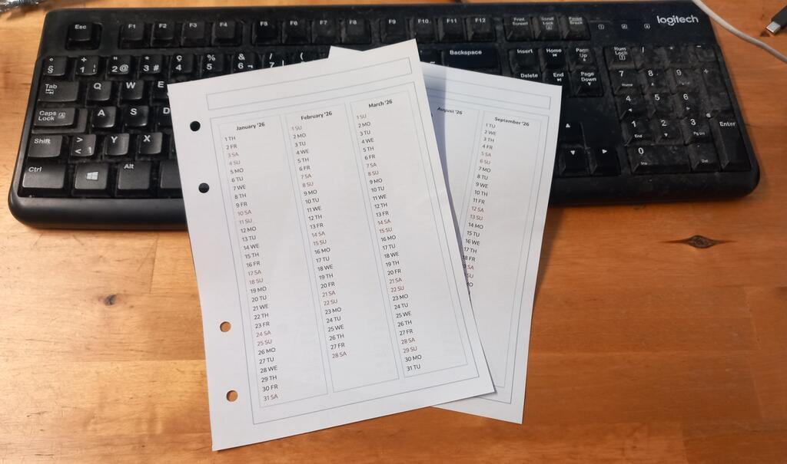

# Printable Calendar

This will give you [calendar-booklet.html](https://defaultbranch.github.io/calendar-booklet/calendar-booklet.html) - open it in your web browser, enter the year, and then go print - on double-sided A4, you will get an A5 booklet with three months per page. This is a plain HTML+JavaScript file, it should work on any current browser and give you the A4/A5 calendar booklet to print, no other dependencies involved - download, copy, share.

## Print Settings

A4, duplex, flip on short edge, 100% scale.

## Why

This was created as a vibe-coding experiment. Browsers can do anything these days. Some years ago "HAL" - hardware abstraction layer, not the crazy machine from 1968, or as someone mentioned, IBM one letter less - now Browsers are machine+OS+runtime abstraction layers; but thanks to the good abstraction, all this can be bundled into HTML, often a single page 😀.

So tired of rip-off "free calendars", I asked my coding AI for such an HTML page, this is it. As long as AI is still available for free, thanks to the many crazy investors and sponsors these days 😀 - this may change soon one way or the other, but currently we live in great times (bar the ongoing homicides, global disbalances, environmental exploitation, and brain-damaged soccer fans)

## License

- **CC0 1.0 Universal**: All content in this repository is dedicated to the public domain. No rights reserved.
- **Details**: See the CC0 legal code at https://creativecommons.org/publicdomain/zero/1.0/legalcode and deed at https://creativecommons.org/publicdomain/zero/1.0/.
